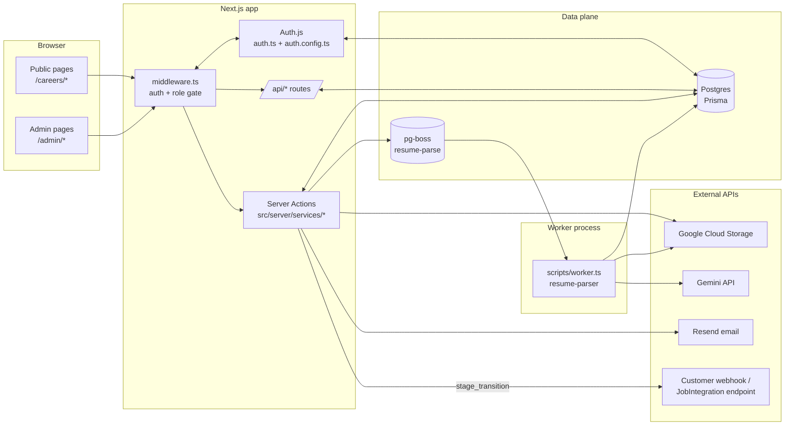

# ScoutLane Architecture

High-level guide to how the codebase fits together. For onboarding/setup, see [`README.md`](./README.md). For the API surface, see [`docs/API.md`](./docs/API.md).

---

## 1. Stack summary

A single Next.js 15 app (App Router) deployed on Vercel, backed by PostgreSQL and a long-running worker process. Auth.js v5 handles authentication. Prisma is the ORM, configured with the `@prisma/adapter-pg` driver-adapter on top of `pg.Pool`.

| Layer | Stack |
|---|---|
| Web | Next.js 15 (App Router, RSC), React 19, Tailwind, shadcn/ui |
| Auth | Auth.js v5 (JWT sessions) + Prisma adapter |
| DB | PostgreSQL + Prisma (`@prisma/adapter-pg`) |
| Queue | pg-boss (Postgres-backed) |
| Storage | Google Cloud Storage |
| Email | Resend |
| LLM | Gemini (resume parsing) |
| Validation | Zod (shared client + server) |

The detailed dependency table is in [`README.md`](./README.md#tech-stack) — not duplicated here.

---

## 2. Runtime topology

Two long-running processes plus external services:

- **Next.js app** (serves UI, REST routes, Server Actions). Runs on Vercel.
- **Worker** — `scripts/worker.ts` started via `pnpm worker`. Polls the pg-boss `resume-parse` queue. Vercel serverless cannot host this (no long-poll on serverless), so run it on Railway / Render / Fly / a small VM.
- **Postgres** — schema in `prisma/schema.prisma`. Also stores the `pgboss` schema (auto-created on first worker connection).
- **GCS, Gemini, Resend** — external HTTP APIs called from both Next.js and the worker.

---

## 3. Request flow



---

## 4. Directory map

```
src/
  app/
    (public)/                  Unauthenticated UI (home, signin, careers)
    (admin)/admin/             Workspace UI (role-gated by middleware)
    api/
      health/                  GET /api/health (open)
      auth/[...nextauth]/      Auth.js handler
      public/jobs/[slug]/      Public application submit (JSON only)
      admin/jobs/.../          Admin REST (pipeline, integrations, export, …)
    layout.tsx, page.tsx, …
  middleware.ts                Edge runtime — auth + role gate
  components/
    ui/                        shadcn primitives (don't hand-edit)
    admin/, public/, pipeline/, applicants/, dashboard/, careers/
  server/
    services/
      _lib/                    requireSession, ServiceError helpers
      jobs/, pipeline/, applicants/   *.ts wrappers + *-impl.ts impls
      settings.ts, templates.ts, current-user.ts
      submit-job-application*.ts
    workers/
      resume-parser.ts         pg-boss worker registration
  lib/
    auth/                      auth.config.ts (edge) + auth.ts (full)
    db/prisma.ts               Prisma client w/ pg adapter
    queue/                     pg-boss client + enqueue helpers
    storage/                   GCS upload
    email/                     Resend send helpers
    llm/                       Gemini resume-parse
    webhook/                   HMAC sign + dispatch
    jobs/, resume/, slug.ts, utils/
  schemas/                     Zod schemas — shared client + server
  generated/prisma/            Generated Prisma client (gitignored)
  types/                       Module augmentations (next-auth.d.ts, …)
prisma/
  schema.prisma                Source of truth for the data model
  migrations/                  Applied migrations — additive only
  seed.ts                      `pnpm db:seed`
scripts/
  worker.ts                    Standalone worker entrypoint
docs/
  API.md                       REST + Server Action reference
  session-reports/             Per-session progress notes
  superpowers/plans/           Implementation plans
```

A few important conventions baked into this layout:

- Import the Prisma client as `@/generated/prisma/client` — **never** `@prisma/client`. The generator's `output` is `../src/generated/prisma`.
- Server Components are the default. Mark a file `"use client"` only when it needs hooks, dnd, charts, etc.
- Page-specific components live in `_components/` (Next.js private folders) co-located with the page.
- Cross-module data access goes through the shared `prisma` client. Service modules **do not import other service modules**.

---

## 5. Auth model

Auth.js v5 is configured in two files for a reason:

| File | Runtime | Adapter | Used by |
|---|---|---|---|
| `src/lib/auth/auth.config.ts` | Edge-safe | none | `src/middleware.ts` |
| `src/lib/auth/auth.ts` | Node | `PrismaAdapter` | Server Actions, REST routes, `auth()` calls |

`middleware.ts` runs on the Edge runtime, which cannot load Prisma. The config split exists so the middleware can read the JWT without pulling Prisma in.

Other relevant facts:

- **JWT strategy** (`session.strategy: "jwt"`), 7-day `maxAge`. The `Session` table exists but is unused at runtime.
- The `role` is enriched onto the JWT inside the `jwt` callback by querying the DB once after sign-in.
- `INITIAL_ADMIN_EMAIL` (env var) bootstraps the first admin: if a user with that email signs in, they are auto-promoted to `ADMIN` and attached to a default organization.
- A **dev-only `Credentials` provider** is mounted when `NODE_ENV === "development"` (or when no Google client is configured). Provider id is `"dev"`. Any email is accepted; the resulting session has `role: "ADMIN"`. **Do not enable in production.**

Role hierarchy:

```
ADMIN > RECRUITER > HIRING_MANAGER   (workspace)
others                                (no admin access)
```

`/admin/*` and `/api/admin/*` require any workspace role. `settings.ts` enforces `ADMIN` for org / team-role mutations.

---

## 6. Data model

See `prisma/schema.prisma` for the authoritative shape. The relationships that matter for understanding flows:

- **`Organization → User`, `Organization → Job`, `Organization → JobTemplate`** — every admin handler scopes by `user.organizationId`.
- **`Job → PipelineStage → JobIntegration`** — one integration per stage at most (`stageId @unique`).
- **`Job → Applicant → StageTransition`** — every move appends a transition row; `Applicant.pipelineStageId` is the current pointer.
- **`Applicant → ApplicantNote`** — the per-author notes timeline (replaces the legacy `Applicant.notes` string column).
- **`Webhook → WebhookLog`** and **`JobIntegration → IntegrationLog`** are separate audit trails. `IntegrationLog.stageTransitionId` provides idempotency: if a successful log exists for a `(integration, transition)` pair, the outbound POST is skipped on retry.
- **Enums:** `UserRole`, `ApplicationStatus`, `ParsingStatus`.

Migrations are **additive only** — never edit or delete an existing migration once it has been pushed. Schema changes go in their own commit: `feat: add X column to Y`.

Job status (published / archived / accepting applications) is **derived** in `src/lib/jobs/status.ts`, not stored as an enum column. The applicant `ApplicationStatus` enum **is** stored, but it is recomputed on every stage move via the static map in `src/server/services/pipeline/update-impl.ts:8-21`.

---

## 7. End-to-end flows

### a) Public application submit → resume parse

1. Candidate fills the apply form on `/careers/[slug]` (`ApplicationForm.tsx`, client component).
2. Form posts a `multipart/form-data` Server Action call to `submitJobApplication` (`src/server/services/submit-job-application.ts` → `-impl.ts`).
3. `submitJobApplicationImpl` validates with `jobApplicationSubmissionSchema`, uploads the resume to GCS (`src/lib/storage/upload.ts`), creates the `Applicant` row, calls `enqueueResumeParse(applicantId, resumeUrl)` from `src/lib/queue/resume.ts`, and sends the confirmation email via Resend.
4. The worker process (`scripts/worker.ts` → `src/server/workers/resume-parser.ts`) picks up the pg-boss job, runs `parseApplicantResumeFromUrl` (`src/lib/resume/parseApplicantResume.ts` → `src/lib/llm/resume.ts` → Gemini), and writes `parsedData` plus `data` back onto `Applicant`. On failure it sets `parsingStatus: FAILED` and re-throws so pg-boss can retry per the queue's `retryLimit`.

The REST route `POST /api/public/jobs/[slug]/applications` is **a different code path** — JSON-only, no file upload, no parse enqueued. It's there for lightweight integrations / status checks, not for the real apply flow.

### b) Pipeline move → webhook + integration fan-out

1. Admin drags an applicant card in `KanbanBoard.tsx`.
2. Drop calls the `moveApplicant` Server Action → `moveApplicantImpl` in `pipeline/update-impl.ts`.
3. Implementation updates `Applicant.{pipelineStageId, status, lastStageChangeAt}` and writes a `StageTransition` row.
4. Fan-out to all active `Webhook`s subscribed to `applicant.status_changed` via `dispatchWebhook` (HMAC-signed, logged to `WebhookLog`).
5. If a `JobIntegration` exists for the target stage and is `active`, dispatch a `stage_transition` POST directly to its `endpointUrl` (Bearer auth optional, logged to `IntegrationLog`, idempotent on `stageTransitionId`).

### c) Resume re-parse retry

1. Admin clicks "Retry" on an applicant with `parsingStatus = FAILED`.
2. Browser POSTs to `/api/admin/jobs/parse-retry/[applicantId]`.
3. Route sets `parsingStatus = PENDING`, then re-enqueues via `enqueueResumeParse`. If the **enqueue itself** throws, route flips status to `FAILED` and returns 500. Parse-time failures (Gemini errors, malformed PDF, etc.) are handled inside the worker, not here.

---

## 8. Conventions

- **Path alias** — `@/*` → `./src/*` (configured in `tsconfig.json` and `vitest.config.ts`).
- **Conventional commits** — `feat:`, `fix:`, `chore:`, etc.
- **Server Components by default**; `"use client"` only when needed.
- **Thin server actions** — `*.ts` is the `"use server"` wrapper, `*-impl.ts` holds the testable implementation.
- **Zod everywhere** at trust boundaries (input validation in `src/schemas/`).
- **Tests** — Vitest (`*.test.ts` co-located, jsdom env), Playwright for E2E.
- **Package manager** — pnpm only. `package-lock.json` is stale and ignored.

---

## 9. Known sharp edges

Things that will bite a new contributor:

- **Two error response shapes.** Server Actions and public routes use `{ success, error }`. Most admin REST routes use `{ error }` only on failure. Branch on `response.ok` first.
- **Pipeline ↔ status coupling.** `Applicant.status` is recomputed from `stage.name.toUpperCase()` on every move. Stage names that don't match a key in `stageNameToStatus` (`update-impl.ts:8-21`) fall back to `REVIEWING`. Seed-created stages use names like `Screening`, `Assessment`, `Offer` — only some map.
- **`createJobImpl` auto-creates an Organization** when the signed-in user has none. Surprising default — be aware before debugging "who created this org?".
- **Public REST submit is JSON-only.** A `resumeUrl` in the body is explicitly rejected. The real upload path is the Server Action.
- **Worker is not on Vercel.** `boss.work()` long-polls; Vercel serverless cannot run it. The enqueue side works fine on Vercel; the consumer side must live elsewhere.
- **Auth config split is load-bearing.** Importing `auth.ts` from `middleware.ts` will pull Prisma into the Edge bundle and break the build. Always use `auth.config.ts` in middleware.
- **Templates are snapshots.** Editing a `JobTemplate` after a `Job` was created from it does not retroactively update the job.
