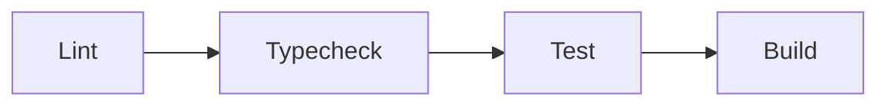

# ScoutLane 🚀

> **AI-powered recruitment platform** — streamline hiring with intelligent candidate matching, pipeline management, and automated workflows.

[](https://nextjs.org)
[](https://www.typescriptlang.org)
[](https://www.prisma.io)
[](https://www.postgresql.org)
[](https://tailwindcss.com)
[](https://authjs.dev)
[](LICENSE)
[](https://codespaces.new/RikepilB/ScoutLane)

---

## 📋 Table of Contents

- [Architecture Overview](#-architecture-overview)
- [Tech Stack](#-tech-stack)
- [Getting Started](#-getting-started)
  - [GitHub Codespaces (recommended)](#github-codespaces-recommended)
  - [Local Development](#local-development)
- [Environment Variables](#-environment-variables)
- [Database Setup](#-database-setup)
- [Seeding Test Data](#-seeding-test-data)
- [Project Structure](#-project-structure)
- [API Documentation](#-api-documentation)
  - [Public Endpoints](#public-endpoints)
  - [Auth Endpoints](#auth-endpoints)
  - [Admin Endpoints](#admin-endpoints)
- [Development Workflow](#-development-workflow)
- [Scripts Reference](#-scripts-reference)

---

## 🏗 Architecture Overview

```
┌─────────────────────────────────────────────────────┐
│                    Next.js 15 App                    │
│  ┌───────────────────────────────────────────────┐  │
│  │         (public)  Route Group                 │  │
│  │  /careers/[slug]  →  Application Form (SSR)  │  │
│  └───────────────────────────────────────────────┘  │
│  ┌───────────────────────────────────────────────┐  │
│  │         (admin)   Route Group                 │  │
│  │  /admin/*         →  Dashboard (protected)    │  │
│  └───────────────────────────────────────────────┘  │
│  ┌───────────────────────────────────────────────┐  │
│  │            API Layer (REST)                   │  │
│  │  /api/auth/**      →  NextAuth.js             │  │
│  │  /api/public/**    →  Public endpoints        │  │
│  │  /api/admin/**     →  Protected endpoints     │  │
│  └───────────────────────────────────────────────┘  │
│  ┌───────────────────────────────────────────────┐  │
│  │         Background Workers (pg-boss)          │  │
│  │  Parse Resume  │  Send Email  │  Webhooks    │  │
│  └───────────────────────────────────────────────┘  │
└─────────────────────────────────────────────────────┘
                         │
           ┌─────────────┴─────────────┐
           ▼                           ▼
    ┌──────────────┐          ┌──────────────┐
    │  PostgreSQL   │          │  S3 Storage   │
    │  (Prisma ORM) │          │  (R2/MinIO)   │
    │  + pg-boss Q  │          │  Resumes/Docs │
    └──────────────┘          └──────────────┘
```

### Key Design Decisions

| Decision | Rationale |
|----------|-----------|
| **Next.js App Router** | Server Components by default, co-located API routes, streaming SSR |
| **Prisma + PostgreSQL** | Type-safe queries, auto-generated client, migration tooling |
| **NextAuth v5 (Auth.js)** | Database sessions, PrismaAdapter, OAuth providers |
| **shadcn/ui + Tailwind v4** | Accessible, unstyled primitives with CSS variables theming |
| **Zustand + react-hook-form** | Lightweight client state + validated forms with Zod |
| **pg-boss** | PostgreSQL-backed job queue (no extra infrastructure) |
| **Route Groups** | `(public)` and `(admin)` for separate layouts and middleware rules |

---

## 🛠 Tech Stack

| Category | Choice |
|----------|--------|
| **Framework** | Next.js 15 (App Router) |
| **Language** | TypeScript 6 (strict) |
| **Database** | PostgreSQL 16 |
| **ORM** | Prisma 7 with `@prisma/adapter-pg` |
| **Auth** | Auth.js v5 (NextAuth) — Google OAuth + database sessions |
| **UI** | Tailwind CSS v4 + shadcn/ui components |
| **Forms** | react-hook-form + Zod 4 validation |
| **State** | Zustand 5 (client) + React Server Components (server) |
| **Queue** | pg-boss (PostgreSQL-backed background jobs) |
| **Storage** | S3-compatible (Cloudflare R2 / MinIO) |
| **Email** | Resend (React Email templates) |
| **LLM** | Google Gemini 2.5 Flash / OpenAI GPT-4o-mini |
| **Tables** | TanStack Table v8 |
| **Charts** | Recharts |
| **Drag & Drop** | dnd-kit |
| **Testing** | Vitest + React Testing Library + Playwright |

---

## 🚀 Getting Started

### GitHub Codespaces (recommended)

[](https://codespaces.new/RikepilB/ScoutLane)

1. Click the badge above or navigate to `https://codespaces.new/RikepilB/ScoutLane`
2. Codespaces will automatically:
   - Install Node.js 22, pnpm, and PostgreSQL 16
   - Copy `.env.example` → `.env`
   - Run `pnpm install`
   - Generate the Prisma client
   - Deploy migrations
   - Seed test data
3. Once the terminal settles, run:

```bash
pnpm dev
```

4. Open the forwarded port **3000** in your browser.

### Local Development

#### Prerequisites

- **Node.js** 22.x LTS (use [fnm](https://github.com/Schniz/fnm) or [nvm](https://github.com/nvm-sh/nvm))
- **pnpm** 9+ (`npm i -g pnpm`)
- **Docker** and **Docker Compose**
- **Git**

#### Setup Steps

```bash
# 1. Clone
git clone https://github.com/RikepilB/ScoutLane.git
cd ScoutLane

# 2. Environment
cp .env.example .env
# Edit .env with your values (at minimum set AUTH_SECRET)

# 3. Start PostgreSQL
docker compose up -d

# 4. Install dependencies
pnpm install

# 5. Generate Prisma client
pnpm prisma:generate

# 6. Run migrations
pnpm prisma:migrate --name init

# 7. Seed test data
pnpm db:seed

# 8. Start dev server
pnpm dev
```

Visit **http://localhost:3000** to see the app.

---

## 🔐 Environment Variables

Full reference at [`.env.example`](.env.example).

| Variable | Required | Description |
|----------|----------|-------------|
| `DATABASE_URL` | ✅ | PostgreSQL connection string |
| `DIRECT_URL` | ✅ | Direct connection for migrations |
| `AUTH_SECRET` | ✅ | Random 32-char base64 (`openssl rand -base64 32`) |
| `AUTH_GOOGLE_ID` | for Google OAuth | Google OAuth client ID |
| `AUTH_GOOGLE_SECRET` | for Google OAuth | Google OAuth client secret |
| `INITIAL_ADMIN_EMAIL` | ✅ | Admin email for first-user seeding |
| `NEXT_PUBLIC_APP_URL` | ✅ | Public URL of the app |
| `S3_ENDPOINT` | for uploads | S3-compatible endpoint |
| `S3_BUCKET` | for uploads | Storage bucket name |
| `S3_ACCESS_KEY_ID` | for uploads | S3 access key |
| `S3_SECRET_ACCESS_KEY` | for uploads | S3 secret key |
| `S3_PUBLIC_BASE_URL` | for uploads | Public base URL for files |
| `RESEND_API_KEY` | for email | Resend API key |
| `EMAIL_FROM` | for email | Sender email address |
| `GEMINI_API_KEY` | for AI features | Google Gemini API key |
| `OPENAI_API_KEY` | for AI features | OpenAI API key (alternative) |
| `INNGEST_EVENT_KEY` | for jobs | Inngest event key |
| `INNGEST_SIGNING_KEY` | for jobs | Inngest signing key |
| `INTEGRATION_KEY_SECRET` | for webhooks | 32-byte base64 (AES-256) |
| `SENTRY_DSN` | optional | Sentry error tracking DSN |

---

## 🗄 Database Setup

### Schema

The [Prisma schema](prisma/schema.prisma) defines 10 models:

```
Organization  ──┬── User ──┬── Account
                │          └── Session
                │
                └── Job ──┬── Applicant
                          ├── PipelineStage
                          ├── Webhook ── WebhookLog
                          └── VerificationToken
```

### Commands

```bash
# Generate migration after schema changes
pnpm prisma:migrate --name <description>

# Apply pending migrations
pnpm prisma:deploy

# Open Prisma Studio (GUI for the database)
pnpm db:studio

# Reset database (drops all data + re-runs migrations)
pnpm prisma:reset

# Regenerate Prisma client
pnpm prisma:generate
```

> ⚠️ Never modify `src/generated/prisma/` directly — it is auto-generated by `prisma generate`.

---

## 🌱 Seeding Test Data

The seed script (`prisma/seed.ts`) populates:

- **1 Organization** — Acme Corp
- **2 Users** — Admin + Recruiter
- **5 Jobs** — Frontend Engineer, Backend Engineer, Designer, DevOps (Contract), ML Intern
- **Pipeline Stages** — New → Screening → Interview → Offer → Hired (per job)
- **8 Sample Applicants** — Per job (first 3 jobs), with random statuses and scores

```bash
# Seed the database
pnpm db:seed

# Reset and re-seed
pnpm prisma:reset && pnpm db:seed
```

Customize the admin email via `INITIAL_ADMIN_EMAIL` in `.env`.

---

## 📁 Project Structure

```
src/
├── app/
│   ├── (public)/               # Public routes (no auth required)
│   │   ├── careers/[slug]/     # Job application page
│   │   └── layout.tsx
│   ├── (admin)/                # Admin dashboard (auth required)
│   │   ├── admin/jobs/         # Job management pages
│   │   │   ├── [id]/
│   │   │   └── new/
│   │   ├── admin/settings/
│   │   └── admin/templates/
│   ├── api/
│   │   ├── auth/[...nextauth]/ # NextAuth route handler
│   │   ├── health/             # Health check endpoint
│   │   └── public/jobs/[slug]/applications/  # Public application API
│   ├── globals.css             # Tailwind theme CSS variables
│   ├── layout.tsx              # Root layout
│   └── page.tsx                # Home page
├── components/
│   ├── public/                 # Public-facing components
│   ├── ui/                     # shadcn/ui primitives
│   ├── applicants/             # Applicant list/detail components
│   ├── dashboard/              # Dashboard widgets
│   ├── form-builder/           # Custom form builder
│   └── pipeline/               # Kanban pipeline components
├── lib/
│   ├── auth/                   # Auth.js configuration
│   ├── db/                     # Prisma client singleton
│   ├── store/                  # Zustand stores
│   ├── utils/                  # Utility functions (cn, etc.)
│   ├── email/                  # Email templates and sending
│   ├── llm/                    # LLM provider wrappers
│   ├── queue/                  # pg-boss job definitions
│   ├── storage/                # S3 file storage helpers
│   └── webhook/                # Webhook dispatch
├── schemas/                    # Zod validation schemas
├── server/
│   ├── services/               # Business logic (server actions)
│   └── workers/                # Background job handlers
├── types/                      # TypeScript type declarations
└── middleware.ts               # Auth middleware

prisma/
├── schema.prisma               # Database schema
├── seed.ts                     # Test data seeder
└── migrations/                 # Migration files

.devcontainer/                  # GitHub Codespaces config
```

---

## 📖 API Documentation

### Public Endpoints

#### `GET /api/health`

Health check. No auth required.

**Response:**
```json
{ "status": "ok", "timestamp": "2026-05-12T00:00:00.000Z" }
```

---

#### `POST /api/public/jobs/:slug/applications`

Submit a job application (or save a draft).

**Request:**
```json
{
  "firstName": "Jane",
  "lastName": "Doe",
  "email": "jane@example.com",
  "phone": "+1 555 123 4567",
  "resumeUrl": "https://storage.example.com/resumes/jane-doe.pdf",
  "customFields": [
    { "id": "field_1", "label": "Portfolio URL", "value": "https://jane.design", "type": "text" }
  ],
  "status": "submitted",
  "jobSlug": "senior-frontend-engineer",
  "_draft": false
}
```

**Response (201):**
```json
{
  "success": true,
  "applicant": {
    "id": "clx...",
    "name": "Jane Doe",
    "email": "jane@example.com",
    "status": "NEW"
  }
}
```

**Notes:**
- Set `"_draft": true` to save as draft without triggering notifications
- Set `"status": "draft"` for draft saves, `"status": "submitted"` for final submission
- Multi-part file upload is handled separately (see file upload endpoint)

---

#### `GET /api/public/jobs/:slug/applications`

Load an existing draft application.

**Query params:**
| Param | Type | Required | Description |
|-------|------|----------|-------------|
| `applicationId` | string | No | Load a specific application |

**Response (200):**
```json
{
  "success": true,
  "data": { "...application data..." }
}
```

**Response (404 — no draft found):**
```json
{ "success": true, "data": null }
```

---

### Auth Endpoints

#### `POST /api/auth/signin`

NextAuth sign-in via Google OAuth.

#### `POST /api/auth/signout`

Sign out and destroy database session.

#### `GET /api/auth/session`

Get the current session. Returns `null` if unauthenticated.

**Response:**
```json
{
  "user": {
    "id": "clx...",
    "name": "Admin User",
    "email": "admin@scoutlane.local",
    "image": null,
    "role": "ADMIN"
  },
  "expires": "2026-06-12T00:00:00.000Z"
}
```

---

### Admin Endpoints (Planned)

> These routes are scaffolded but not yet implemented. The directory structure is ready for development.

| Method | Endpoint | Description |
|--------|----------|-------------|
| `GET/POST/PUT` | `/api/admin/organizations` | Organization CRUD |
| `GET/POST/PUT/DELETE` | `/api/admin/users` | User management |
| `GET/POST/PUT/DELETE` | `/api/admin/jobs` | Job posting CRUD |
| `GET/POST/PUT/DELETE` | `/api/admin/jobs/:id/stages` | Pipeline stage management |
| `GET/POST/PUT` | `/api/admin/applicants/:id` | Applicant detail and status updates |
| `GET` | `/api/admin/analytics` | Dashboard analytics data |
| `GET/POST` | `/api/admin/templates` | Job posting templates |
| `GET/POST/PUT/DELETE` | `/api/admin/webhooks` | Webhook configuration |

**Auth:** All admin endpoints require a valid database session with `ADMIN`, `RECRUITER`, or `HIRING_MANAGER` role. Returns `401` if unauthenticated, `403` if unauthorized.

---

## 💻 Development Workflow

### Branch Strategy

```
main        → Production-ready code
develop     → Integration branch for features
feature/*   → Individual feature branches
fix/*       → Bug fixes
```

### Commit Convention

We use conventional commits via [commitlint](https://commitlint.js.org/):

```
feat: add resume parsing worker
fix: handle empty pipeline stages
docs: update API documentation
refactor: extract auth middleware
test: add application form tests
chore: update dependencies
```

### CI Pipeline



Run locally: `pnpm lint && pnpm typecheck && pnpm test`

### Testing

```bash
pnpm test                                          # Watch mode (dev)
pnpm test -- --run                                 # One-shot (CI)
pnpm test -- --run src/lib/jobs/status.test.ts     # Single file
pnpm test -- -t "round-trips"                      # By name pattern
pnpm test:e2e                                      # Playwright (none configured yet)
```

**Current suite: 47 tests across 6 files, all passing.**

| Layer | File | Coverage |
|-------|------|----------|
| Domain | `src/lib/jobs/status.test.ts` | Job status derivation, persistence round-trip |
| Utility | `src/lib/slug/slugify.test.ts` | Unicode normalization, separator collapsing, edge cases |
| Utility | `src/lib/slug/index.test.ts` | `buildJobSlug` shape, length cap, fallback |
| Schema | `src/schemas/job.test.ts` | `jobCreationSchema` boundaries, `jobStatusSchema` enum |
| Auth | `src/lib/auth/auth.config.test.ts` | NextAuth `jwt` and `session` callbacks as pure functions |
| API route | `src/app/api/admin/jobs/[id]/pipeline/route.test.ts` | GET handler with mocked Prisma |

**Conventions:**

- Tests are **co-located** with source: `foo.ts` ↔ `foo.test.ts`. Vitest's `include: "**/*.test.{ts,tsx}"` picks them up wherever they live.
- Add `// @vitest-environment node` at the top of any test that doesn't touch the DOM (everything in the table above does this). The global setup file (`src/test/setup.ts`) loads jest-dom matchers conditionally so node-env tests don't pull in jsdom.
- Mock Prisma via `vi.hoisted` + `vi.mock("@/lib/db/prisma", …)` — see the pipeline route test for the canonical pattern. The shared mock factory lives at `src/test/prisma-mock.ts`.

**Two pinned bug tests** assert *current* behavior so a future fix has to deliberately update them rather than silently change the contract:

1. `src/schemas/job.test.ts` — `optionalShortString` only transforms `""` → `undefined` for `slug` (its regex rejects `""`); for `location`/`type`/`salary`/`templateId` the empty string passes through unchanged.
2. `src/app/api/admin/jobs/[id]/pipeline/route.test.ts` — stage names `Screening` / `Offer` / `Hired` produce empty applicant columns because they don't match any `ApplicationStatus` enum value.

When fixing either bug, update the corresponding test in the same commit.

---

## 📜 Scripts Reference

| Script | Description |
|--------|-------------|
| `pnpm dev` | Start dev server (port 3000) |
| `pnpm build` | Production build |
| `pnpm start` | Start production server |
| `pnpm lint` | ESLint check |
| `pnpm typecheck` | TypeScript check |
| `pnpm test` | Run Vitest unit/integration tests |
| `pnpm test:e2e` | Run Playwright E2E tests |
| `pnpm prisma:generate` | Regenerate Prisma client |
| `pnpm prisma:migrate` | Create a new migration |
| `pnpm prisma:deploy` | Apply pending migrations |
| `pnpm prisma:reset` | Reset database |
| `pnpm db:seed` | Seed test data |
| `pnpm db:studio` | Open Prisma Studio UI |

---

## 🤝 Contributing

1. Fork the repository
2. Create a feature branch (`git checkout -b feature/amazing-feature`)
3. Commit your changes (`git commit -m 'feat: add amazing feature'`)
4. Push to the branch (`git push origin feature/amazing-feature`)
5. Open a Pull Request

---

## 📄 License

MIT — see [LICENSE](LICENSE).
