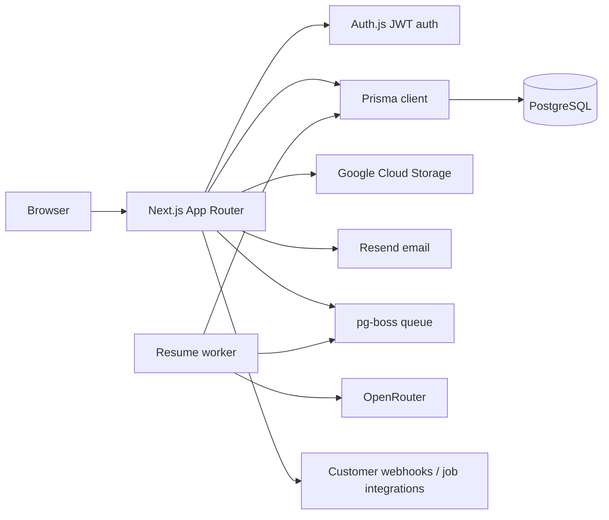

# ScoutLane Architecture

Last reviewed: 2026-05-19.

ScoutLane is a modular Next.js recruitment platform. The app serves public career pages, authenticated admin workflows, API routes, and Server Actions. Durable resume parsing runs through a separate pg-boss worker process.

## Runtime Topology



The web process can run on Vercel. The worker process cannot run as a Vercel serverless function because `pg-boss` workers are long-running. Run `pnpm worker:resume` on Railway, Render, Fly, a VM, or any persistent Node runtime.

## Trust Boundaries

| Boundary | Entry Points | Current Controls | Open Hardening Work |
|---|---|---|---|
| Public web | `/`, `/careers`, `/careers/[slug]` | noindex career metadata, closed-job checks, public-only data | Decide final careers-board stance against direct-link-only assessment language |
| Public API | `/api/public/*`, application Server Action | Zod validation, duplicate email check, job acceptability check | Rate limits, stronger file validation, generic failure tests |
| Admin UI | `/admin/*` | Auth.js middleware and workspace roles | Keep service-level auth as source of truth |
| Admin API | `/api/admin/*` | Authenticated route handlers and ownership checks | Route-by-route audit for organization/job ownership |
| Server Actions | `src/server/services/*` | `requireSession()` pattern and Prisma scoping | API parity and consistent validation/error shapes |
| Worker | `pnpm worker:resume` | pg-boss queue, isolated parsing process | Deployment proof, queue limits, retry/alert policy |
| External services | GCS, Resend, OpenRouter, webhooks | Env vars and service modules | Secret scanning, rate limits, and logging policy |

## Directory Map

```text
src/
  app/
    (public)/careers/        Public career pages
    (admin)/admin/           Admin dashboard routes
    api/                     REST endpoints
    signin/                  Auth page
  components/
    admin/ applicants/ dashboard/ pipeline/ public/ ui/
  generated/prisma/          Generated Prisma client, gitignored
  lib/
    auth/                    Edge-safe auth config and full Auth.js instance
    db/                      Prisma singleton
    email/                   Resend helpers
    jobs/                    Job status and department helpers
    llm/                     OpenRouter client and resume parser
    match/                   Applicant scoring
    resume/                  PDF/DOC text extraction and parse orchestration
    storage/                 GCS upload helpers
    webhook/                 Webhook dispatch and signing
  schemas/                   Shared Zod schemas
  server/
    queues/                  pg-boss queue clients
    services/                Server Actions and business logic
    workers/                 Long-running worker entrypoints
  test/                      Test setup and mocks
  middleware.ts              Auth gate

prisma/
  schema.prisma              Data model source of truth
  migrations/                Additive migrations
  seed.ts                    Seed data

tests/e2e/                   Playwright smoke tests
docs/                        Project documentation
```

## Auth Model

Auth.js is split into two files:

- `src/lib/auth/auth.config.ts` is Edge-safe and used by `middleware.ts`.
- `src/lib/auth/auth.ts` adds the Prisma adapter and database-backed callbacks for API routes and Server Actions.

Sessions use JWT strategy. The `Session` model exists for adapter compatibility but is not the runtime session source of truth.

Public paths include `/`, `/signin`, `/access-denied`, `/api/health`, `/careers/*`, and `/api/public/*`. Admin paths use middleware plus service-level checks. Workspace roles are `ADMIN`, `RECRUITER`, and `HIRING_MANAGER`; `settings.ts` reserves organization and team mutations for `ADMIN`.

Development login is intentionally permissive when `NODE_ENV === "development"` or Google OAuth is not configured. It accepts any email and returns an `ADMIN` session. Do not rely on that in production.

Production readiness requirement: deployed environments must set `NODE_ENV=production`, configure Google OAuth, and verify that the credentials/dev provider is unavailable. This should be part of the final demo and security checklist.

## Data Model

Important relationships:

- `Organization` owns users, jobs, and templates.
- `Job` owns applicants, pipeline stages, stage transitions, and job integrations.
- `Applicant.pipelineStageId` is the current pipeline pointer.
- `Applicant.status` is stored but derived from stage moves through `src/server/services/pipeline/update-impl.ts`.
- `StageTransition` is the audit trail for applicant movement.
- `JobIntegration` is one active outbound integration per stage.
- `Webhook` and `WebhookLog` are separate organization-wide webhook records.
- `IntegrationLog.stageTransitionId` supports per-stage integration idempotency.
- `EmailLog` records email send outcomes.
- `JobAlert` stores public job alert subscriptions.

Prisma client imports must come from `@/generated/prisma/client` or related generated paths, never directly from `@prisma/client`.

## Main Flows

### Candidate Application

1. Candidate opens `/careers/[slug]`.
2. `ApplicationForm` submits multipart data to `submitJobApplication`.
3. The action validates input, uploads the resume, creates an applicant, enqueues a pg-boss resume parse job, and sends confirmation email.
4. The resume worker extracts text from the uploaded file, parses structured data through OpenRouter, scores the applicant, and updates the applicant row.

### Pipeline Move

1. Admin drags an applicant on the Kanban board.
2. `moveApplicant` updates `Applicant.pipelineStageId`, derived status, and `lastStageChangeAt`.
3. A `StageTransition` row is inserted.
4. Organization webhooks and per-stage job integrations are dispatched and logged.

### Resume Retry

1. Admin calls `/api/admin/jobs/parse-retry/[applicantId]`.
2. The route sets parsing status to `PENDING` and re-enqueues the resume parse job.
3. Parse failures are handled by the worker and recorded as `FAILED`.

## Security Architecture

- Auth is layered: middleware blocks obvious unauthenticated navigation, while Route Handlers and Server Actions must still verify the session and data ownership.
- Organization scoping is the tenant boundary. Jobs, templates, applicants, pipeline stages, integrations, and exports should be reachable only through the owning organization.
- Candidate resumes and parsed resume data are sensitive. They should not be logged raw, exposed through public indexes, or sent to integrations unless intentionally configured.
- Resume text is untrusted input before it reaches the LLM parser. The parser must validate structured output and treat the source document as data, not instructions.
- Webhook and per-stage integration dispatches send candidate data to configured external systems. Integration logs should help debugging without exposing bearer tokens or unnecessary candidate data.
- File uploads need explicit production policy for size, allowed types, content-type validation, and storage ACLs.
- Public endpoints should have rate limits before production use because they can create applicants, queue parse jobs, send email, or subscribe job alerts.

## Conventions

- Server Components by default; use `"use client"` only for stateful UI, hooks, DnD, charts, and browser APIs.
- Server Action wrappers are thin; testable behavior belongs in `*-impl.ts`.
- Zod validates trust boundaries.
- Migrations are additive only after they are shared.
- Avoid importing service modules into other service modules unless there is a clear boundary reason.
- Templates are snapshots. Updating a template does not mutate jobs already created from it.

## Known Sharp Edges

- Resume parsing uses OpenRouter via the `openai` SDK.
- The worker must be deployed separately from the Vercel app.
- Public JSON application submit is not the same as the real multipart application form.
- API error shapes are not fully unified; branch on `response.ok` first.
- API parity is incomplete: many admin mutations are Server Actions only.
- Production auth must prove the development credentials provider is not exposed.
- Upload validation and rate limiting need explicit evidence before production data.
- OneDrive can cause local `EPERM` errors with dependency executables. A clean non-OneDrive copy has been used for verification in prior sessions.
